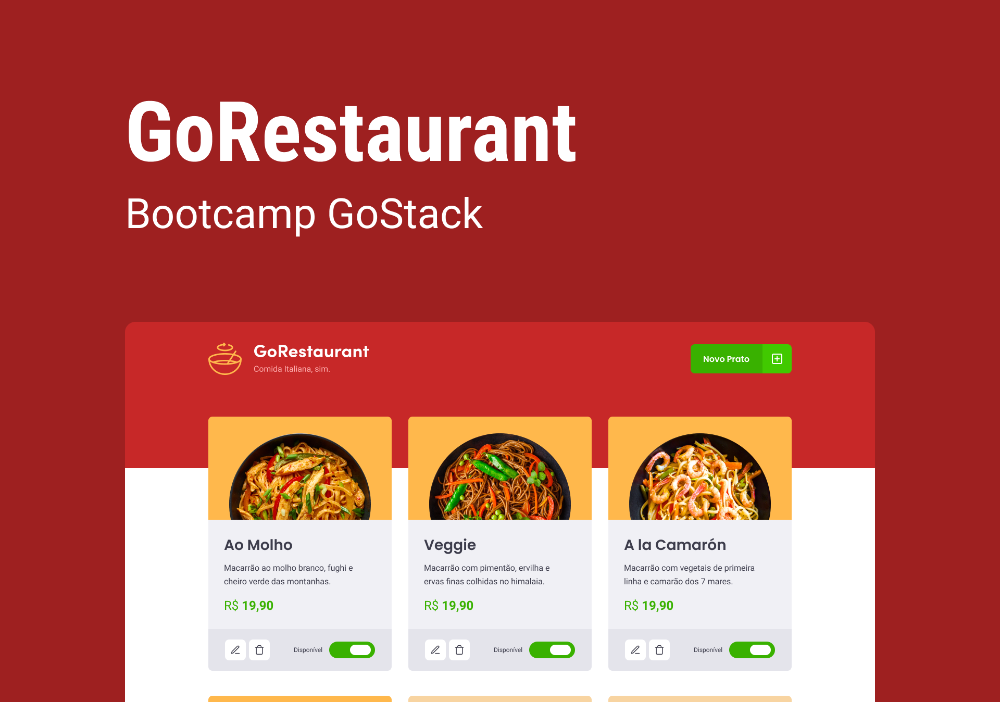

<h1>Desafio: GoRestaurant Web</h1>

<h4>Esse repositório é referente ao décimo desafio do Bootcamp GoStack turma 12, oferecido pela <a href="https://rocketseat.com.br/">Rocketseat </a>.</h4>

Recebemos um template e o editamos para que atendesse aos requisitos propostos de interações com uma fake API através de um json-server

```Listar os pratos de comida da sua API:``` Sua página Dashboard deve ser capaz de exibir uma listagem, com o campo title, value, e description e available de todos os pratos de comida que estão cadastrados na sua API.

```Adicionar novos pratos de comida a sua API:``` Em sua página Dashboard você deve abrir um modal ao clicar no botão Novo Prato no Header. Esse modal deve ser responsável por cadastrar uma nova food passando os campos image, name, description, value.

```Editar pratos de comida da sua API:``` Em sua página Dashboard você deve abrir um modal ao clicar no botão Editar Prato. Esse modal deve ser responsável por editar uma food passando os campos image, name, description, value.

```Remover pratos de comida da sua API:``` Em sua página Dashboard você deve remover um prato de comida ao clicar no botão com ícone de lixeira no componente Food.

```Alterar disponibilidade dos pratos de comida da sua API:``` Em sua página Dashboard você deve alterar a disponibilidade de um prato de comida ao clicar no switch que é controlado pelo valor de available.

## Tecnologias Usadas
- TypeScript
- ReactJS
- Unform
- yup
- axios
- json-server
- polished
- react-hooks
- styled-components
- Teste automatizados

Concluído no dia: **16/08/2020**

